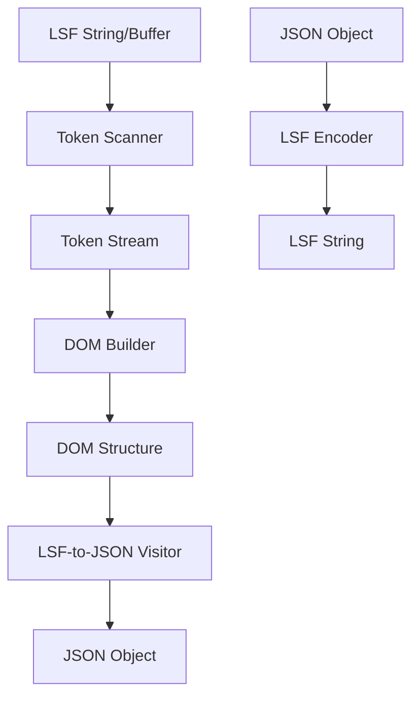
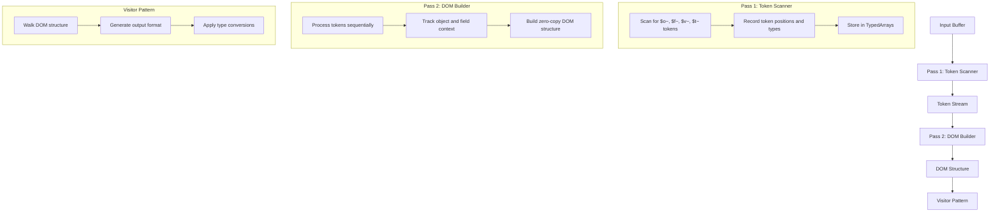

# LSF System Architecture

## Core Architecture

LSF 3.0 follows a streamlined architecture with these key components:



### Parser Architecture (v3.0)
For LSF 3.0, we're implementing a strict two-pass parser:



## Key Design Patterns

### 1. Two-Pass Processing Pattern
The parser uses a strict two-pass approach:
- First pass: identifies all tokens without interpretation
- Second pass: builds DOM structure based on token stream

### 2. DOM Builder Pattern
A Document Object Model (DOM) is constructed during the second pass, with nodes representing objects, fields, and values.

### 3. Visitor Pattern
Used for traversing the DOM structure when converting to other formats, allowing clean separation between structure and output.

### 4. Zero-Copy/Span Pattern
Instead of string copies, we store buffer spans (start/length) for maximum performance.

### 5. Pre-allocation Pattern
Memory is pre-allocated based on input size estimates to minimize allocations during parsing.

### 6. TypedArray Optimization
Using TypedArrays for numeric data to optimize memory usage and access patterns.

## Component Relationships

### Token Scanner to DOM Builder
- Token scanner identifies all tokens and their positions
- Token stream is passed to DOM builder
- DOM builder processes tokens sequentially, tracking context

### DOM Builder to DOM
The DOM builder creates a structure with these relationships:
- Objects contain fields
- Fields contain values or multiple values (implicit arrays)
- Values can be primitives with optional type hints

### DOM to Visitor
The DOM structure is traversed by visitors that can:
- Convert to JSON
- Pretty-print for debugging
- Transform to other formats

## Technical Decisions

### 1. Two-Pass Approach
The LSF 3.0 parser uses two distinct passes:
1. First pass identifies all tokens without interpretation
2. Second pass builds the DOM structure with proper context

### 2. Flat Structure
**LSF 3.0 mandates a flat structure.** Unlike JSON, objects cannot be nested directly within fields. An `$o~` token is only valid at the top level or immediately following a `$f~` token if that field represents the *single* object being defined. Implicit arrays of values are allowed ($f~key$v~1$v~2), but arrays or objects as direct values within a field are not ($f~key$v~[1,2] or $f~key$v~{a:1} are invalid LSF 3.0).
This simplifies parsing for LLMs and implementations.

### 3. Implicit Arrays
Arrays in LSF 3.0 are implicit - multiple values for the same field form an array:
```
$f~scores$v~98.5$v~87.3$v~92.1
```

### 4. Memory Management
- Pre-allocated TypedArrays with efficient growth strategies
- Zero-copy approach for all string data

## Architecture Evolution

### v2.0 to v3.0 Changes
1. Removed explicit array tokens (`$a~`)
2. Added value token (`$v~`) for explicit value marking
3. Simplified to three core structural tokens
4. Adopted implicit arrays (multiple values = array)
5. Switched to strict two-pass architecture
6. Enhanced focus on performance optimization

These architecture decisions support the goals of maximum performance, reliability, and ease of implementation across languages while simplifying the format for LLMs. 