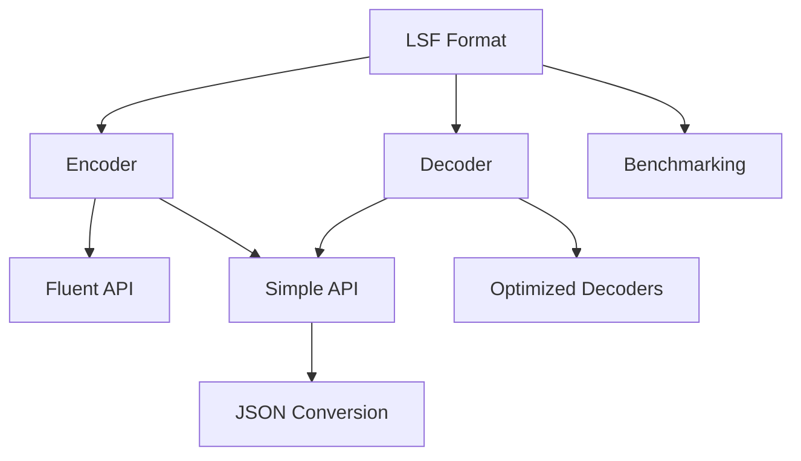
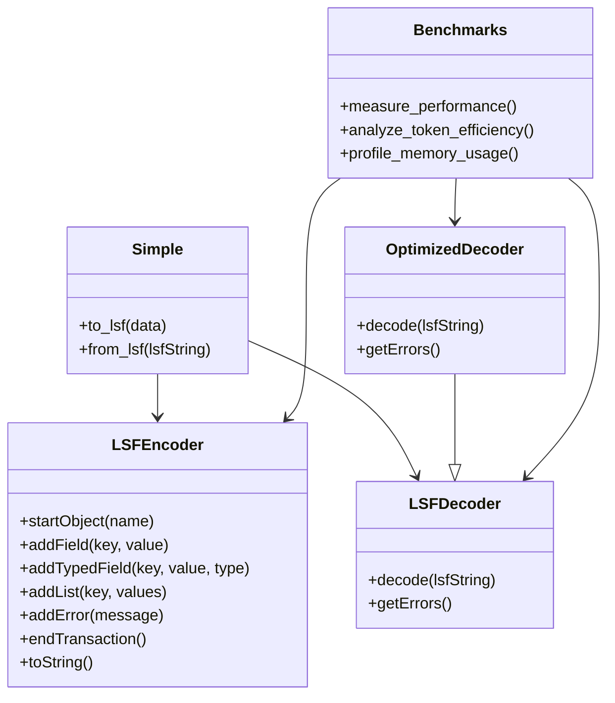
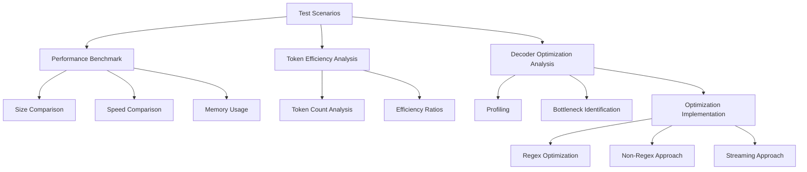

# LSF System Patterns

## System Architecture

LSF follows a clean, simple architecture designed for ease of implementation across multiple languages:



### Core Components

1. **Specification**: The LSF format definition (grammar, tokens, and rules)
2. **Encoder**: Converts structured data to LSF format
3. **Decoder**: Parses LSF format into structured data
4. **Simple API**: High-level convenience methods for quick encoding/decoding
5. **Converters**: Utilities to convert between LSF and other formats (primarily JSON)
6. **Benchmarking**: Tools to measure performance and token efficiency
7. **Optimized Decoders**: Alternative decoder implementations for better performance

## Key Technical Decisions

### Token Design (`$x~` pattern)

LSF uses a distinct pattern for all tokens:
- Dollar sign prefix (`$`)
- 1-2 character identifier (e.g., `o`, `f`, `t`, `r`, `l`, `e`, `x`, `v`)
- Section sign suffix (`~`)

This pattern was chosen specifically because:
- Extremely unlikely to appear in normal text
- Distinct pattern that's easy for LLMs to recognize and reproduce
- Fixed 3-character length for all tokens
- Works across all programming languages
- Non-ambiguous in parsing

### Flat Structure

LSF intentionally uses a flat structure with no nesting capabilities:
- All objects are top-level
- Relationships are expressed through object names or field references
- This design drastically simplifies parsing and generation

### Error Recovery

Error handling is built into the format itself:
- Each record is independent
- Error markers (`$e~`) can be used to annotate problems
- Parsing continues even when errors are encountered
- Provides both the successfully parsed data and error details

### Type System

LSF v1.2 introduces an optional type system:
- Type hints (`$t~`) provide explicit type information
- Supports common types: int, float, bool, null, bin, str
- Binary data uses base64 encoding to avoid token collisions
- Types are optional, defaulting to string representation

## Design Patterns

Each LSF implementation follows consistent design patterns:

### Fluent API

```
encoder.startObject("user")
       .addField("name", "John")
       .addList("tags", ["admin", "user"])
       .toString()
```

### Simple Conversion API

```
lsf_string = to_lsf({"user": {"name": "John", "tags": ["admin", "user"]}})
data = from_lsf(lsf_string)
```

### Transaction Support

```
encoder.startObject("user")
       .addField("id", 123)
       .startObject("profile")
       .addField("name", "John")
       .endTransaction()
```

### Factory Pattern for Optimized Decoders

```python
# Get optimized decoder by type
decoder = get_optimized_decoder('fast')  # Options: 'fast', 'nonregex', 'streaming'

# Use like standard decoder
data = decoder.decode(lsf_string)
```

## Component Relationships

For each language implementation, the relationship between components follows a consistent pattern:



## Benchmarking Architecture

The benchmarking system follows a consistent pattern across language implementations:



### Key Benchmarking Components

1. **Shared Scenarios**: Common test data across implementations
2. **Performance Measurement**:
   - Encode/decode timing comparison with JSON
   - Memory usage profiling
   - Operation count analysis
3. **Token Efficiency**:
   - Token estimation (chars/4)
   - Comparison with compact and pretty-printed JSON
   - Scenario-specific analysis
4. **Optimization Approaches**:
   - Bottleneck identification through profiling
   - Multiple optimization strategies
   - Comparative performance analysis

## Optimization Patterns

The Python implementation includes several optimization patterns:

### Pre-compilation Pattern

```python
def __init__(self, *args, **kwargs):
    super().__init__(*args, **kwargs)
    # Pre-compile regex patterns
    self._token_pattern = re.compile(r'\$([otefxv])~(.*?)(?=\$[otefxv]~|\Z)')
    self._record_separator = re.compile(r'\$r~')
    self._list_separator = re.compile(r'\$l~')
```

### Lookup Table Pattern

```python
def __init__(self, *args, **kwargs):
    super().__init__(*args, **kwargs)
    # Create lookup tables for token types and handlers
    self._token_handlers = {
        'o': self._handle_object,
        'f': self._handle_field,
        't': self._handle_typed_field,
        'e': self._handle_error,
    }
```

### Fast Path Pattern

```python
def decode(self, lsf_string: str) -> Dict[str, Any]:
    # Fast path for empty strings
    if not lsf_string:
        return {}
        
    # Fast path for simple patterns
    if "$o~" not in lsf_string:
        return {}
```

### Streaming Single-Pass Pattern

```python
def decode(self, lsf_string: str) -> Dict[str, Any]:
    # Process the string character by character in a single pass
    i = 0
    length = len(lsf_string)
    
    while i < length:
        # Look for token markers
        if lsf_string[i] == '$' and i + 2 < length and lsf_string[i+2] == '~':
            # Process token directly without regex
```

## Standardization

To ensure consistency across implementations:
- Token patterns and grammar are strictly defined
- Error handling follows the same recovery patterns
- API naming conventions are kept consistent
- Type handling is standardized
- All implementations pass the same test suite
- Benchmarking methodologies are consistent

These architectural decisions make LSF both simple to implement and robust in practice, focusing on the specific needs of LLM-generated structured data. The addition of benchmarking tools and optimized decoders helps identify performance characteristics and improve real-world usage. 