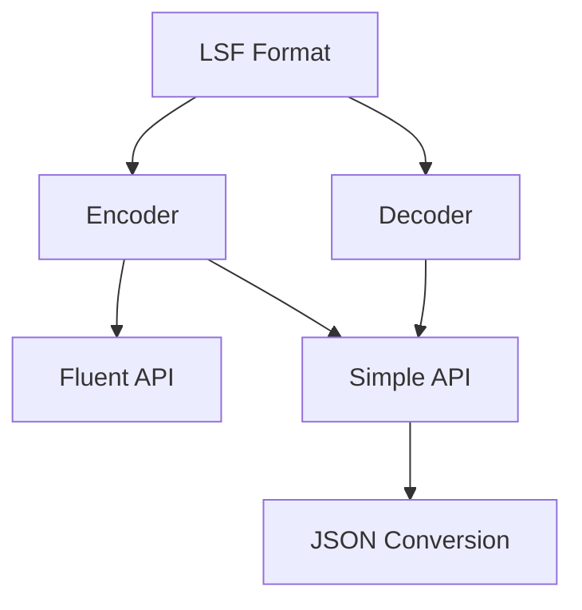
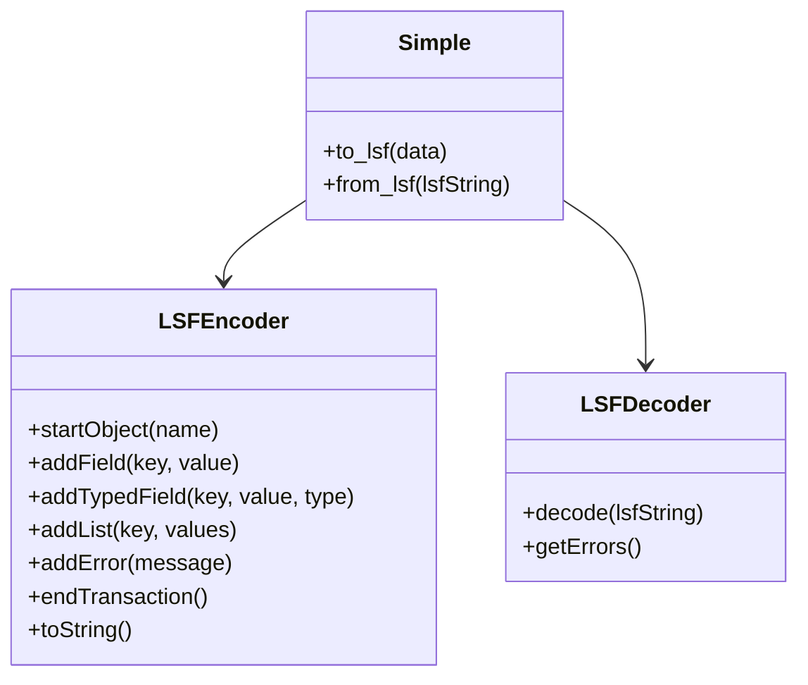

# LSF System Patterns

## System Architecture

LSF follows a clean, simple architecture designed for ease of implementation across multiple languages:



### Core Components

1. **Specification**: The LSF format definition (grammar, tokens, and rules)
2. **Encoder**: Converts structured data to LSF format
3. **Decoder**: Parses LSF format into structured data
4. **Simple API**: High-level convenience methods for quick encoding/decoding
5. **Converters**: Utilities to convert between LSF and other formats (primarily JSON)

## Key Technical Decisions

### Token Design (`$x§` pattern)

LSF uses a distinct pattern for all tokens:
- Dollar sign prefix (`$`)
- 1-2 character identifier (e.g., `o`, `f`, `t`, `r`, `l`, `e`, `x`, `v`)
- Section sign suffix (`§`)

This pattern was chosen specifically because:
- Extremely unlikely to appear in normal text
- Distinct pattern that's easy for LLMs to recognize and reproduce
- Fixed 3-character length for all tokens
- Works across all programming languages
- Non-ambiguous in parsing

### Flat Structure

LSF intentionally uses a flat structure with no nesting capabilities:
- All objects are top-level
- Relationships are expressed through object names or field references
- This design drastically simplifies parsing and generation

### Error Recovery

Error handling is built into the format itself:
- Each record is independent
- Error markers (`$e§`) can be used to annotate problems
- Parsing continues even when errors are encountered
- Provides both the successfully parsed data and error details

### Type System

LSF v1.2 introduces an optional type system:
- Type hints (`$t§`) provide explicit type information
- Supports common types: int, float, bool, null, bin, str
- Binary data uses base64 encoding to avoid token collisions
- Types are optional, defaulting to string representation

## Design Patterns

Each LSF implementation follows consistent design patterns:

### Fluent API

```
encoder.startObject("user")
       .addField("name", "John")
       .addList("tags", ["admin", "user"])
       .toString()
```

### Simple Conversion API

```
lsf_string = to_lsf({"user": {"name": "John", "tags": ["admin", "user"]}})
data = from_lsf(lsf_string)
```

### Transaction Support

```
encoder.startObject("user")
       .addField("id", 123)
       .startObject("profile")
       .addField("name", "John")
       .endTransaction()
```

## Component Relationships

For each language implementation, the relationship between components follows a consistent pattern:



## Standardization

To ensure consistency across implementations:
- Token patterns and grammar are strictly defined
- Error handling follows the same recovery patterns
- API naming conventions are kept consistent
- Type handling is standardized
- All implementations pass the same test suite

These architectural decisions make LSF both simple to implement and robust in practice, focusing on the specific needs of LLM-generated structured data. 